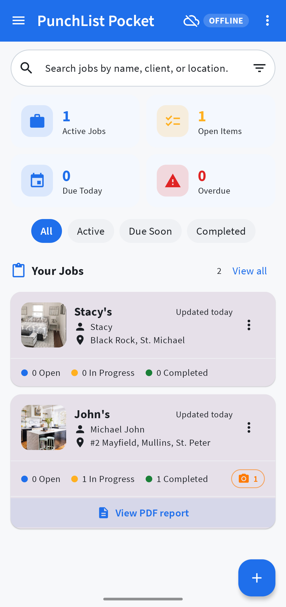
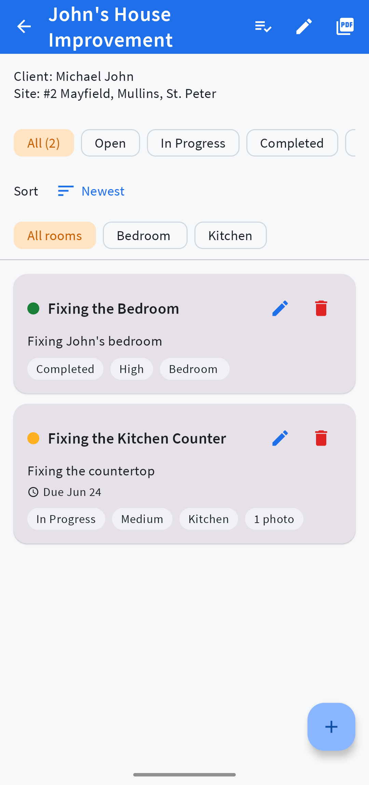
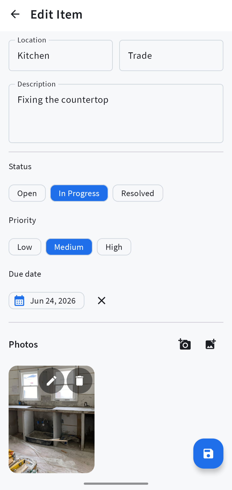
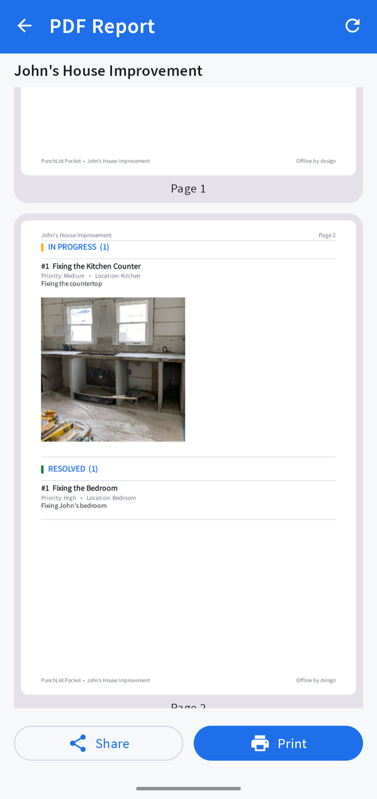

# PunchList Pocket

**PunchList Pocket** is an offline-first Android construction punch-list app built for small contractors, site supervisors, field workers, and DIY remodelers.

The app helps users create job folders, track unfinished work, attach photos, organize punch items, set due dates, and generate reports without needing internet access, cloud storage, or user accounts.

---

## App Screenshots

### Home Screen

### Client / Job Page

### Client Form

### PDF Report Page

---

## Project Overview

Many construction punch-list tools are expensive, cloud-based, or overbuilt for small jobs. PunchList Pocket was designed as a lightweight mobile alternative focused on simplicity, speed, and offline usability.

The app allows users to manage construction jobs, record punch items, document issues with photos, organize tasks by room or location, track item progress, and export PDF reports.

This project was built as a practical Android portfolio project to demonstrate mobile app development, local database storage, offline-first design, and user-focused software design.

---

## Key Features

* Create and manage construction jobs or project sites
* Add punch items for unfinished or defective work
* Track item status, due dates, and completion progress
* Organize punch items by room, area, or location
* Attach photos to document site issues
* Use checklist templates for repeated inspections
* Generate and share PDF reports
* Store data locally on the device
* Work fully offline with no login required

---

## Tech Stack

* **Kotlin**
* **Android**
* **Jetpack Compose**
* **Material 3**
* **Room Database**
* **Gradle**
* **Local-first storage**
* **PDF export functionality**

---

## Why I Built This

I built PunchList Pocket to solve a real field-work problem for small contractors and site supervisors.

On smaller construction jobs, workers often need a simple way to track incomplete work, take photos, organize tasks, and create reports. Many existing tools are too complex, expensive, or dependent on internet access.

PunchList Pocket focuses on being simple, fast, and useful in real job-site conditions where internet access may not always be reliable.

---

## Skills Demonstrated

This project demonstrates experience with:

* Android app development
* Kotlin programming
* Jetpack Compose UI development
* Room database design
* Offline-first application architecture
* Mobile UI/UX design
* CRUD functionality
* Local data management
* State management
* PDF report generation
* Practical problem-solving for real-world users

---

## Target Users

PunchList Pocket is designed for:

* Small contractors
* Site supervisors
* Construction teams
* Home renovation workers
* DIY remodelers
* Field inspectors

---

## Current Status

This project is currently a portfolio Android application and is being developed as part of my software development and mobile app development experience.

---

## Future Improvements

Planned improvements include:

* Improved photo annotation tools
* More advanced PDF report customization
* Job progress charts and summaries
* Export and import backup options
* Better checklist template management
* Improved search and filtering
* Optional cloud sync in the future

---

## Project Purpose

This project was created to demonstrate my ability to design and build a useful Android application from concept to implementation.

It is also part of my professional portfolio and LinkedIn project showcase.

---

## Repository

GitHub Repository: [PunchList Pocket App](https://github.com/Griff-OB/Punchlist-Pocket-App)

---

## License

This project is licensed under the MIT License.

